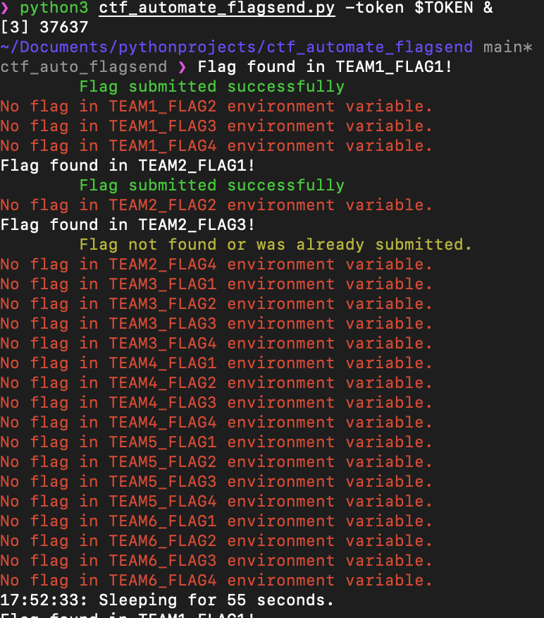

# Red Team Association - CTF Flag Submission Helper

## What does it do?
A helper script to automate sending the flags to the server. The script reads from environment variables. They are sent every 1 minute. You probably want to use other bash scripts or python scripts to automate setting those variables. 

To run:
* `export TOKEN={Session_Cookie_Value_From_RTA_Website}`
* `python3 ctf_automate_flagsend -t $TOKEN &`

Syntax of env variables: `TEAM{number}_FLAG{number}` e.g. `TEAM1_FLAG1`
You'll want to update `update_env.sh` to have an echo statement with "TEAM1_FLAG1=RTA{flag}" or to run a subscript similar to the examples provided. 

