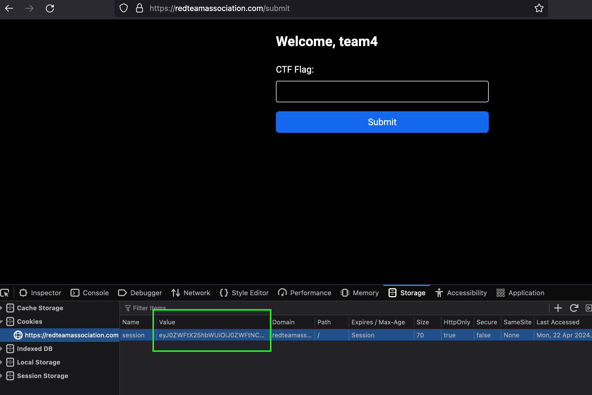

# Red Team Association - CTF Flag Submission Helper

## What does it do?
A helper script to automate sending the flags to the server. The script reads from environment variables. They are sent every 1 minute. You probably want to use other bash scripts or python scripts to automate setting those variables. 

To run:
* `export TOKEN={Session_Cookie_Value_From_RTA_Website}`
* `python3 ctf_automate_flagsend -t $TOKEN &`

##Syntax of env variables:
`TEAM{number}_FLAG{number}` e.g. `TEAM1_FLAG1`
You'll want to update `update_env.sh` to have an echo statement with "TEAM1_FLAG1=RTA{flag}" or to run a subscript similar to the examples provided. 

##Options:
* --submit_url 
  * [OPTIONAL] Change the submission URL. Default "https://redteamassociation.com/submit"
* -token 
  * [REQUIRED] The session token to submit. You can find the token here after logging in.

* --sleep
  * [OPTIONAL] The sleep interval to use. Default is 55 secs.')
* --number_of_teams
  * [OPTIONAL] Number of teams participating. Default 6.')
* --flags_per_team
  * [OPTIONAL] Flags per team. Default 4.')
* --env_updater_script
  * [OPTIONAL] Path to a script to update environment variables with flags.

